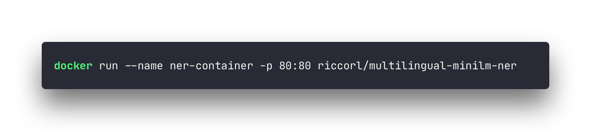

[](https://open.vscode.dev/Riccorl/ner-serve)
[](https://ner-serve-streamlit.herokuapp.com/)


[](https://hub.docker.com/r/riccorl/multilingual-minilm-ner)


# ner-serve

Simple NER model using Docker, FastAPI, ONNX and Multilingual Mini-LM. For a live version go 
[here](https://ner-serve-streamlit.herokuapp.com/).



Run:

```bash
cd ner_serve
MODEL_DIR="{$MODEL_DIR}" DEVICE="{$DEVICE}" uvicorn main:app
```

`$MODEL_DIR` is the base directory of the model, e.g. `./resources/{$MODEL_DIR}`.  

Environment variables:
- `$DEVICE` can be `cpu` or `cuda` (default `cpu`).
- `$MODEL_DIR` default is `resources/model`.

### Docker

Images are available through the [Docker Hub](https://hub.docker.com/r/riccorl/multilingual-minilm-ner)

```bash
docker run --name {$CONTAINER_NAME} -p 80:80 riccorl/multilingual-minilm-ner
```

#### Build From Source

Build:

```bash
./build_docker.sh {$DEVICE} {$IMAGE_NAME} {$MODEL_DIR}
```

Run:

```bash
docker run --name {$CONTAINER_NAME} -p 80:80 {$IMAGE_NAME}
```

#### Environment Variables
There are few environment variables that can be passed to the docker container:

##### `TIMEOUT`

Workers silent for more than this many seconds are killed and restarted. It is usefull when loading 
multiple languages because it takes time to download all the preprocessing models.
By default `TIMEOUT="500"`

```bash
docker run --name {$CONTAINER_NAME} -e TIMEOUT="1200" -p 80:80 {$IMAGE_NAME}
```

##### `WORKERS_PER_CORE`

This image will check how many CPU cores are available in the current server running your container.

It will set the number of workers to the number of CPU cores multiplied by this value.

By default:

* `1`

You can set it like:

```bash
docker run --name {$CONTAINER_NAME} -e WORKERS_PER_CORE="3" -p 80:80 {$IMAGE_NAME}
```

If you used the value `3` in a server with 2 CPU cores, it would run 6 worker processes.

You can use floating point values too.

So, for example, if you have a big server (let's say, with 8 CPU cores) running several applications, and you
have a FastAPI application that you know won't need high performance. And you don't want to waste server 
resources. You could make it use `0.5` workers per CPU core. For example:

```bash
docker run --name {$CONTAINER_NAME} -e WORKERS_PER_CORE="0.5" -p 80:80 {$IMAGE_NAME}
```

In a server with 8 CPU cores, this would make it start only 4 worker processes.

##### `MAX_WORKERS`

Can be used to limit the number of simultaneous process. By default, the value is `1`.

```bash
docker run --name {$CONTAINER_NAME} -e MAX_WORKERS="1" -p 80:80 {$IMAGE_NAME}
```

##### `LOG_LEVEL`

The log level for Gunicorn.

One of:

* `debug`
* `info`
* `warning`
* `error`
* `critical`

By default, set to `info`.

```bash
docker run --name {$CONTAINER_NAME} -e LOG_LEVEL="info" -p 80:80 {$IMAGE_NAME}
```
